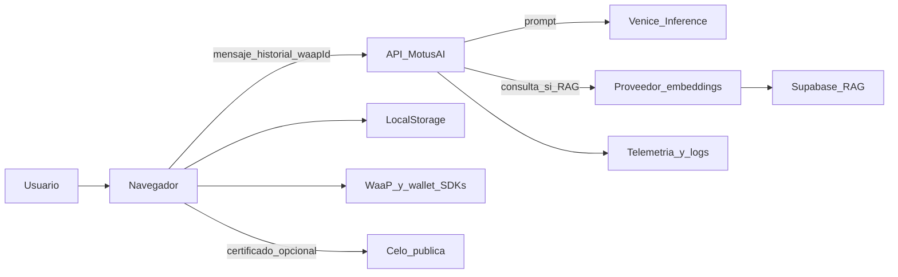

# Mapa de datos verificable — MotusAI

**Estado:** evidencia técnica para la revisión legal  
**Fecha:** 25 de septiembre de 2026  
**Límite:** describe comportamiento observado en código. La configuración productiva, contratos, ubicación de datos y plazos de retención deben confirmarse antes de hacer afirmaciones públicas.

## Flujo principal

## Inventario de datos, finalidad y ubicación

| Categoría | Ejemplos | Origen | Uso/finalidad observada | Ubicación/destinatario | Retención observada |
| --- | --- | --- | --- | --- | --- |
| Contenido de chat | mensaje, historial, respuesta, campos lógicos, nivel de riesgo | Usuario y modelo | Generar respuesta de supervisión o Q&A | API, Venice; copia del hilo en navegador | Historial de hasta 48 mensajes por turno; copia local hasta borrado por usuario; servidor no persiste hilos en el código revisado |
| Consulta RAG | texto de consulta y embedding | Usuario | Buscar conocimiento MotusDAO | Proveedor de embeddings y Supabase si RAG está habilitado | No definida por el repositorio; depende de proveedor/configuración |
| Cuenta e identidad | correo, wallet EOA, smart wallet, identificador WaaP | SDK WaaP / navegador | Autenticación, sincronización de perfil, límite de tasa | WaaP, `localStorage`, Postgres del hub, logs de telemetría | Cuenta/DB: no definida aquí; `localStorage`: hasta limpieza; logs: no definida |
| Metadatos operativos | modo, latencia, `ragHits`, `riskLevel`, errores, `authSubject` | API | Operación, medición, depuración y rate limiting | Memoria del proceso, `console.info`, hosting/logs | Agregados y rate limits en memoria; proveedor de logs por confirmar |
| Datos de sesión/SDK | cookies Supabase, almacenamiento WaaP, WalletConnect/Reown | Navegador/SDKs | Sesión y conexión de wallet | Navegador y proveedores SDK | Según navegador/SDK; confirmar en producción |
| Preferencias | rol, tema, sidebar | Usuario | Personalización de interfaz | `motusdao-ui-storage` en `localStorage` | Hasta limpieza del sitio |
| Acuse de material disociado | fecha ISO de aceptación | Usuario | Control de UI previo al chat | `motusai.disassociated-material.ack.v2` en `localStorage` | Hasta limpieza del sitio |
| Certificado | wallet, `sessionId`, transacción | Usuario/API | Emitir certificado de asistencia opcional | Celo pública y `localStorage` local | Registro blockchain público; no eliminable como dato on-chain |

## Controles existentes y límites

| Control | Evidencia | Límite relevante |
| --- | --- | --- |
| Aviso y checklist de anonimización | `components/motusai/AnonymizationGate.tsx` | Es declaración del usuario; no detecta ni elimina identificadores y no cubre Q&A. |
| Límite de tasa | `lib/motusai-rate-limit.ts` y API | Es in-memory; su eficacia distribuida depende del despliegue. |
| Requisito de identidad en producción | `lib/motusai-auth.ts` | Confía en `x-motus-waap-id`; no verifica una sesión/firma WaaP en servidor. |
| Persistencia local de hilo | `lib/motusai-thread-storage.ts` | No impide transmisión previa del contenido a API/proveedor de inferencia. |
| Métricas protegidas en producción | `app/api/motusai/metrics/route.ts` | Requiere que `MOTUSAI_METRICS_KEY` esté configurada. |
| Recursos de riesgo | UI y salida estructurada de MotusAI | No convierten el producto en servicio de emergencia ni sustituyen un protocolo humano. |

## Declaraciones que son seguras y declaraciones que requieren confirmación

### Se puede afirmar tras validación de copy

- La app pide no incluir nombres, direcciones, teléfonos, IDs ni otros identificadores de pacientes.
- MotusAI es un apoyo reflexivo y no sustituye supervisión humana, juicio clínico, diagnóstico, tratamiento ni emergencia.
- Los hilos se guardan localmente en el navegador bajo las claves de MotusAI y el usuario puede eliminarlos limpiando datos del sitio.
- El texto del chat se transmite para generar una respuesta de IA.
- El certificado opcional publica datos de transacción asociados a la wallet en Celo.

### No afirmar sin confirmar contrato/configuración de producción

- Que Venice, OpenAI, Supabase, WaaP, hosting o cualquier proveedor retiene o no retiene datos por un plazo específico.
- Que ningún proveedor usa contenido para entrenamiento; depende del modelo, modo de privacidad, contrato y configuración realmente desplegados.
- Que todos los mensajes son anonimizados, cifrados extremo a extremo, HIPAA/GDPR-compliant o imposibles de reidentificar.
- Que no hay cookies, analítica o transferencias internacionales.
- Que existe borrado completo de logs, backups, proveedores o blockchain.

## Acciones recomendadas (MVP vs GA)

**Para validación MVP:** confirmar que el copy público coincide con el despliegue (proveedores, disociación, no-entrenamiento por MotusDAO) y evitar claims regulatorios.

**Para GA / escala (backlog, no veto del MVP):**

1. Retirar contenido de chat/outputs de logs de error o aplicar redacción robusta.
2. Autenticación de servidor verificable.
3. Documentar proveedor/modelo/privacidad de inferencia en producción con contratos.
4. DPA y ubicaciones de datos de subprocesadores materiales.
5. Política de retención/borrado operativa.
6. Aceptación versionada de documentos cuando el modelo de negocio lo requiera.
